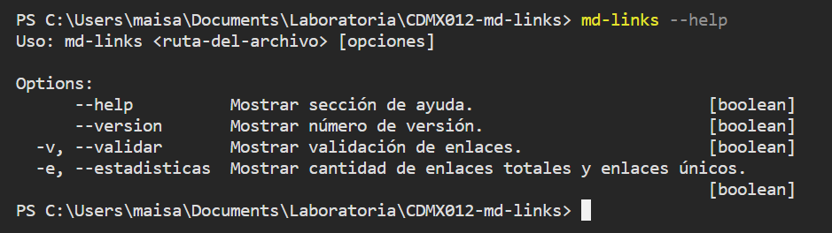
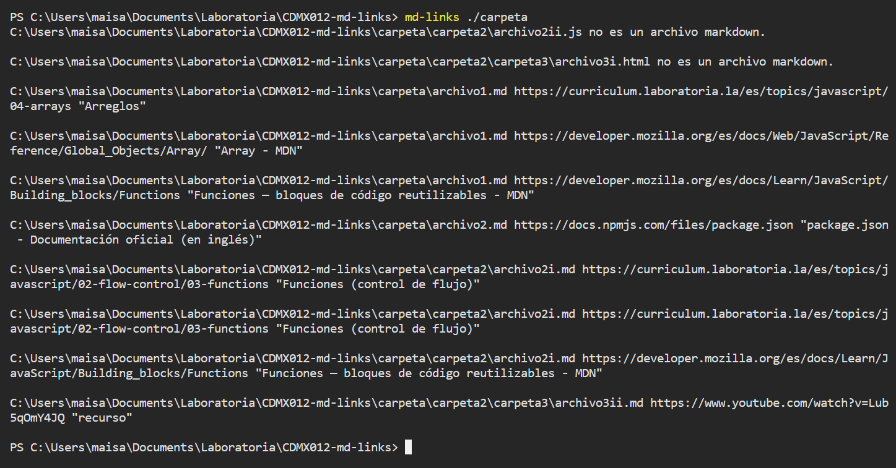
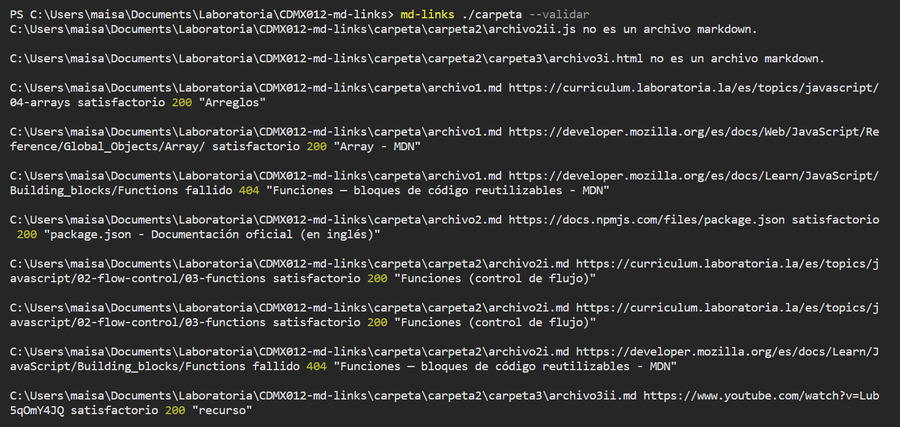
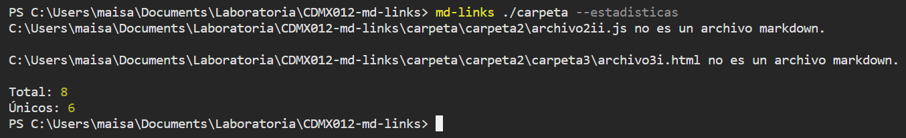
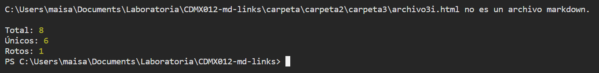

# Markdown Links

## Índice

* [1. Descripción](#1-descripción)
* [2. Instalación](#2-instalación)
* [3. Uso](#3-uso)
* [4. Ejemplos](#4-ejemplos)

***

## 1. Descripción

El módulo mdLinks proporciona una manera sencilla y eficaz de realizar peticiones HTTP, obtener datos sobre las validaciones y estadísticas sobre los enlaces que se analicen. Este proyecto utiliza [Yargs](https://yargs.js.org/) y [Axios](https://axios-http.com/), así como [Jest](https://jestjs.io/) para realizar los tests.

## 2. Instalación

Para instalar, únicamente se necesita correr el siguiente comando en la terminal:


## 3. Uso
La estructura básica para utilizar mdLinks, es la siguiente
`md-links <ruta-del-archivo> --opciones`

Según lo que necesites obtener, puedes utilizarlo de las siguientes maneras: 

* `md-links <ruta-del-archivo>` para obtener el enlace, la ruta absoluta del archivo en el que se encuentra y el texto que lo acompaña (limitado a 50 caracteres).

* `md-links <ruta-del-archivo> --validar` para realizar la petición HTTP y obtener, además de la información básica, el código de estatus y "satisfactorio" o "fallido", según sea el caso de la validación.

* `md-links <ruta-del-archivo> --estadisticas` para obtener la cantidad total de enlaces, así como el número de enlaces únicos.

* `md-links <ruta-del-archivo> --validar --estadisticas` para realizar la petición HTTP y obtener, además de las estadísticas básicas, el número de enlaces rotos que se encontraron. El orden de las opciones es irrelevante.

En todos los casos, se reconocen los archivos sin extensión .md y se devuelve el mensaje "*Ruta del archivo* no es un archivo markdown." 

Si te surge una duda respecto al uso, puedes acceder a la sección de help mediante `md-links --help`. Así mismo, si no se ingresa una ruta o las opciones correctas, esta sección se desplegará especificando cuál es el problema.


## 4. Ejemplos
Para esta serie de ejemplos, se utiliza la siguiente estructura de carpetas y archivos:

```text
.
├── carpeta
|  ├── carpeta2
|  |   ├── carpeta3
|  |    ├── archivo3i.html
|  |    ├── archivo3ii.md
|  ├── archivo2i.md
|  ├── archivo2ii.js
├── archivo1.md
├── archivo2.md
├── archivo3.md 
```
### Obtener información básica de los enlaces


### Realizar validación


### Obtener estadísticas 


### Realizar validación con estadísticas

